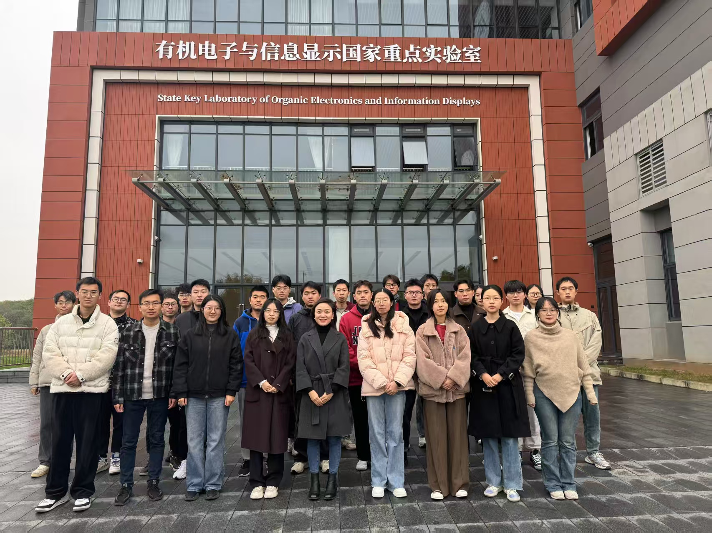

# NIO微纳光电集成实验室 · 课题组网站

南京邮电大学材料科学与工程学院 / 理学院 **高丽教授课题组** 官方站点源码仓库。

**在线访问：** [https://iamlgao.cn/](https://iamlgao.cn/)

---

## 课题组简介

课题组隶属于南京邮电大学柔性电子全国重点实验室，围绕 **光学超表面**、**二维光电器件** 与 **深度学习光学设计** 等方向开展研究，涵盖器件设计、制备表征与传感成像等应用。

主要研究方向：

- Metasurface integrated two-dimensional optoelectronic devices
- Deep learning enabled metasurface device design and sensing applications
- Fabrication and application of flexible and tunable nanophotonic devices

---

## 网站结构

| 栏目 | 目录 | 说明 |
|------|------|------|
| 主页 | `content/_index.md` | 研究方向、最新动态与论文 |
| 实验设备 | `content/tour/` | 实验室仪器介绍 |
| 新闻动态 | `content/post/` | 研究进展与组内新闻 |
| 团队成员 | `content/people/`、`content/authors/` | 成员卡片与个人主页 |
| 学术活动 | `content/event/` | 组会、年会等活动 |
| 论文成果 | `content/publication/` | 论文列表与引用 |
| 联系方式 | `content/contact/` | 地址、邮箱与地图 |

---

## 技术栈

- [Hugo](https://gohugo.io/) 0.135.0（Extended）
- [Hugo Blox Builder](https://docs.hugoblox.com/) 学术主题
- GitHub Actions 自动构建并部署至 GitHub Pages

---

## 本地预览

需安装 **Hugo Extended**（推荐 0.135.0）：

```bash
git clone https://github.com/BaikelWang/NEO_Research_Group.git
cd NEO_Research_Group

hugo mod get
hugo server
```

浏览器打开 [http://localhost:1313/](http://localhost:1313/) 即可预览。

---

## 加入我们

欢迎对微纳光子学与光电器件感兴趣的同学加入课题组。如有意向，请通过网站 [Contact](https://iamlgao.cn/contact/) 页面或邮件 **iamlgao@njupt.edu.cn** 与我们联系。


