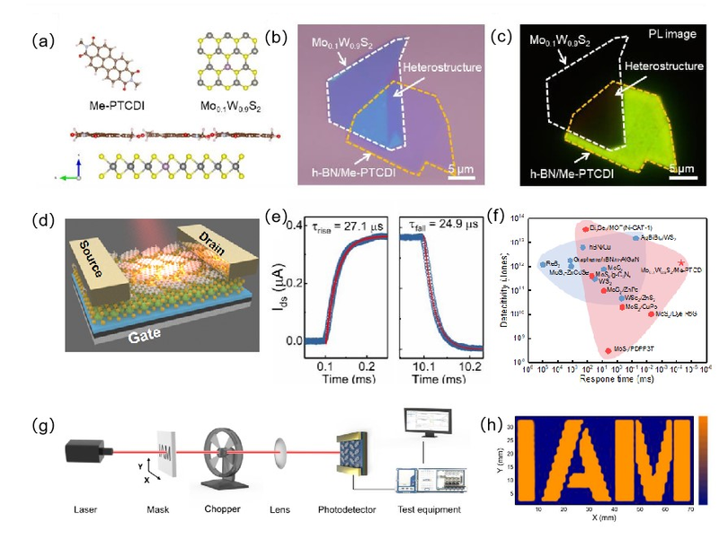
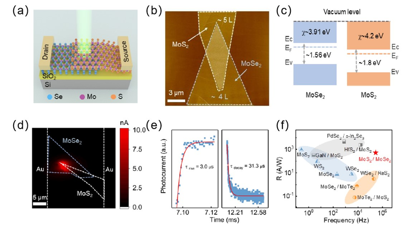
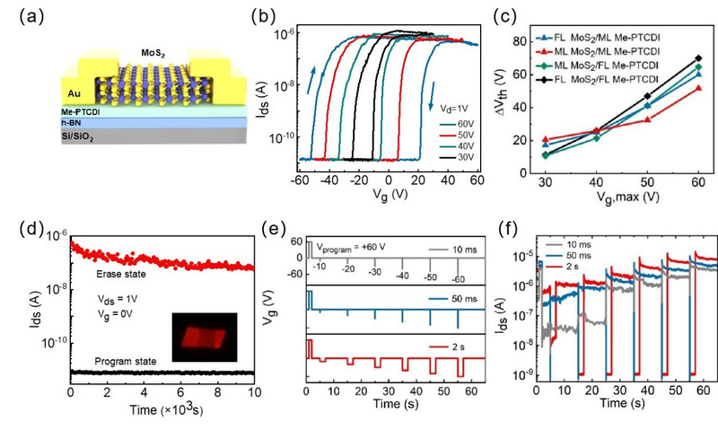

作者：赵慧娟，高丽  

近期，南京邮电大学理学院高丽教授团队在二维异质结光电探测器和存储器件领域取得重要进展，与苏州实验室、东南大学合作，在国际知名期刊《激光与光子学评论》（Laser & Photonics Reviews）、《应用物理学快报》（Applied Physics Letters）上发表三篇研究论文，以下为具体报道。

<!--more-->

## 1. 高速二维有机/无机杂化范德瓦尔斯异质结光电探测器
在Laser & Photonics Reviews发表题为“High Speed Photodetector Based on 2D Organic/Inorganic Hybrid Van Der Waals Heterostructure Devices”的文章中，高丽教授团队针对二维无机范德瓦尔斯(vdWs)异质结构光电探测器中光吸收弱和响应速度慢的科学问题，提出了一种基于二维有机/无机杂化vdWs异质结构的高速光电探测器。该探测器采用钼钨二硫化物(Mo0.1W0.9S2)替代传统二维半导体，并引入N’二甲基-3,4,9,10-并四苯二甲酸亚胺(Me-PTCDI)作为增益层，显著提高器件的光吸收效率。单层Me-PTCDI/少层Mo0.1W0.9S2结合的器件同时实现快速响应（24.9 μs）和高达4.4 × 1011 Jones的探测率，在60000 Hz的高频下仍能保持稳定的成像性能，为高速成像应用提供了新的可能性。高丽教授、东南大学倪振华教授和苏州实验室铉丰源研究员为共同通讯作者，团队青年教师赵慧娟博士为论文第一作者。

全文链接：[link](https://onlinelibrary.wiley.com/doi/abs/10.1002/lpor.202400192)

## 2. 快速响应高响应度MoS2/MoSe2异质结光电探测器
团队针对如何提高二维材料光电探测器的响应速度和响应度这一科学问题，构建二维垂直堆叠MoS2/MoSe2 vdW异质结结构，有效促进了光生载流子的分离，通过优化器件结构和转移方法，优化界面质量，减少缺陷引入，显著提高器件性能。在532 nm激光照射下，该光电探测器展现出528.1 A/W的高响应度和3 ~30 μs的响应时间，显示出在下一代高性能单像素成像传感应用中的巨大潜力。相关工作发表到国际知名期刊Applied Physics Letters，题目为Fast and high-responsivity MoS2/MoSe2 heterostructure photodetectors enabled by van der Waals contact interfaces。高丽教授、团队于远方博士和苏州实验室铉丰源研究员为共同通讯作者，团队青年教师赵慧娟博士为论文第一作者。

全文链接：[link](https://pubs.aip.org/aip/apl/article-abstract/125/3/033102/3303642/Fast-and-high-responsivity-MoS2-MoSe2?redirectedFrom=fulltext) 

## 3. 可调控存储窗口的二维混合范德瓦尔斯异质结构存储器件
针对二维材料存储器件中不稳定的电荷捕获态限制器件性能的问题，高丽教授团队系统研究了由二维有机和无机材料组成的杂化异质结存储器件。将MoS2作为沟道材料，多层Me-PTCDI分子晶体作为电荷捕获层，实现对存储器件滞后窗口的有效调控。通过调整有机层厚度和栅压，器件的回滞窗口可以在13-70 V范围内有效调节，并达到高开关电流比(>104)和长保持时间(104 s)。器件在经过1000次循环的耐久性测试后，表现出稳定性和可靠性。此外，器件具有多级存储效应，为设计新型高性能二维存储器件提供新思路。相关工作发表到国际知名期刊Applied Physics Letters，题目为Controllable memory window in two-dimensional hybrid van der Waals heterostructured devices。高丽教授、汪联辉教授和朱力博士为共同通讯作者，团队青年教师赵慧娟博士为论文第一作者。

全文链接：[link](https://pubs.aip.org/aip/apl/article-abstract/124/17/173103/3284349/Controllable-memory-window-in-two-dimensional?redirectedFrom=fulltext)

 上述研究获得国家自然科学基金、国家重点研发计划、江苏省双创博士计划、南京邮电大学有机电子与信息显示国家重点实验室项目、南京邮电大学人才引进科研启动基金等资助。

