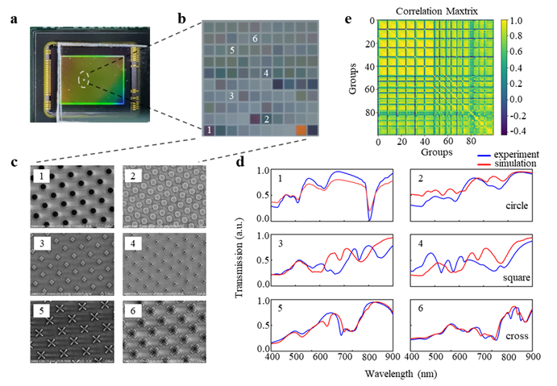

作者：张昊旻，赵慧娟，高丽
发表于：**_Nanophotonics_**

<!--more-->

## 1. 导读
光谱学是分析物质与光相互作用并精确测定其波长依赖性的一门科学技术，它为获取未知样本的详细定性和定量分析提供了一种高效且相对准确的手段。然而，传统高精度光谱仪通常需要配备复杂的光学元件和足够长程的光路进行分光，不仅导致设备体积庞大、成本高昂，也限制了实验室外的广泛应用。近年来，便携式和低成本的光谱传感和成像显现了较强的应用需求，因此开发微型智能光谱仪以代替传统光谱仪已成为主流的研究方向。

针对上述问题，南京邮电大学高丽教授团队在Nanophotonics发表的最新文章中报道了一种新颖的快照计算光谱（SCS,
Snapshot Computational Spectroscopy）工具，该工具由超表面集成计算光谱仪（MICS,
Metasurface Integrated Computational Spectroscopy）和深度神经网络（DNN,
Deep Neural Network）构成，旨在实现光学材料的快速分析。工作原理如图 1 所示，待测样品的结构和材料信息包含在透射/反射光谱中，该信息由超表面集成的图像传感器拍摄光强度图像进行编码和捕获，而后由重建算法解码频谱信息，并馈送到深度神经网络中，实现材料信息的直接分类和回归。所有计算重建的光谱均实现与传统光谱仪相当的光谱检测精度，而计算光谱工具的整体尺寸仅为50 mm × 50 mm × 100 mm，光谱采样速度不到 1 秒。
该方法为快速准确地预测材料特性提供一个新颖的理论框架，同时满足对光谱采集和分析工具微型、快速、准确的需求。

## 2. 研究背景
光谱分析在化学、物理学、生物学等多个学科中占据着核心地位，它通过解析材料对电磁辐射（光）的吸收、发射或散射特性，来推断材料的成分和结构信息。该技术在材料表征、食品安全检测、纳米材料研究以及生物分子分析等领域发挥着不可替代的作用。而传统光谱仪如分光光谱仪，拉曼光谱仪和傅里叶光谱仪由于其复杂的几何光路和笨重的色散元件阻碍了光谱仪在低成本、便携、快速和准确的光谱分析上的应用。而与传统的几何光学相比，纳米光子结构可以将光路的长度扩展到比其物理尺寸大数百万倍。纳米光子结构本身表现出一种独特的光-物质相互作用，其透射和反射行为可以称为光学响应方程。通过小阵列纳米光子结构的光学响应方程进行光谱信息编码，基于压缩传感理论光谱重建算法，实现光谱信息的精确解码和重建。例如，光子晶体结构或超表面与互补金属氧化物半导体（CMOS）或电荷耦合器件（CCD）传感器的集成推动了紧凑和低成本光谱分析工具的发展。在计算光谱仪的辅助下，结合深度学习算法，可以高效地对重建光谱数据进行分类和回归判断，从而实现对物质结构和组成的精确分析。这种技术融合为开发便携式、低成本的快照式计算光谱表征工具提供了强有力的支持，极大地推动了光谱分析技术在多个领域的应用潜力。

## 3. 创新研究
针对上述挑战，研究人员从超表面阵列滤波器出发，设计出了一组10×10的可满足高精度光谱重建响应方程需求的超表面滤波阵列（见图2c），其中超表面阵列的尺寸仅为200μm×200μm。通过电子束光刻制备超表面阵列后，与商用CCD图像传感芯片集成为计算光谱仪。由于超表面阵列替代了光栅与几何光学透镜，极大的缩小了光谱仪的尺寸并且降低了成本。该光谱仪的工作范围为400~900 nm波段，光谱分辨率达到0.4 nm，并且响应速度极快，有效了目解决了目前传统光谱仪体积大，价格昂贵，响应速度慢等缺点。

此外，团队引入了深度神经网络模型(DNN)用来进行物质光学信息准确高效的表征分析。该DNN模型由回归网络和分类网络同时构成，使用模拟或实验数据训练，可实现多种不同物质的表征预测。研究团队为了验证其可行性，分别使用了不同材料及厚度构成的法布里-珀罗腔及不同物质溶液作为预测对象（见图3），证明了DNN可以基于计算光谱数据准确预测光学微腔和溶液的重要特性，该方法预测的腔长参数和溶液浓度误差均维持在1.5%以下。

## 4. 应用与展望
研究团队提出的通过深度学习赋能的快照式计算光谱技术，可以快速、精确地表征材料特性，这为便捷智能化的材料分析技术提供了新的理论基础。未来，通过优化编码器和光电探测器的设计和制造，微型计算光谱仪的采样范围有望扩展至紫外和红外区域，同时有望进一步缩减设备尺寸。由于其制造与CMOS 技术兼容，未来有望将MICS技术集成应用于手持式光谱仪或智能移动设备中。用于日常生活中在生物医学、食品和环境测试场景中的快速光谱检测和信息识别。。

该研究成果以**_“Snapshot computational spectroscopy enabled by deep learning”_**为题发表在**_Nanophotonics_**。

本文作者分别是Haomin Zhang，Quan Li，Huijuan Zhao，Bowen Wang，Jiaxin Gong，Li Gao，其中Huijuan Zhao和Li Gao教授为共同通讯作者。高丽教授团队隶属于南京邮电大学有机电子与信息显示国家重点实验室。