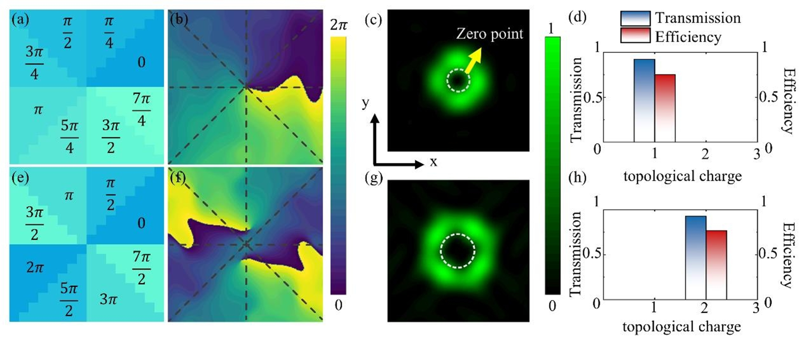
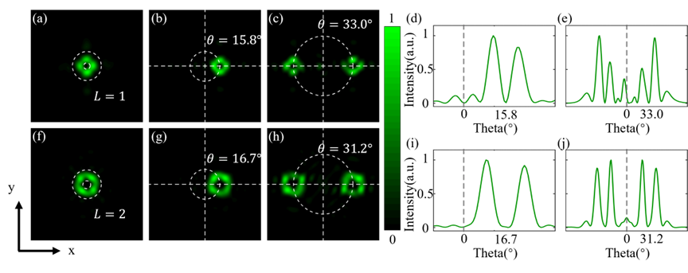
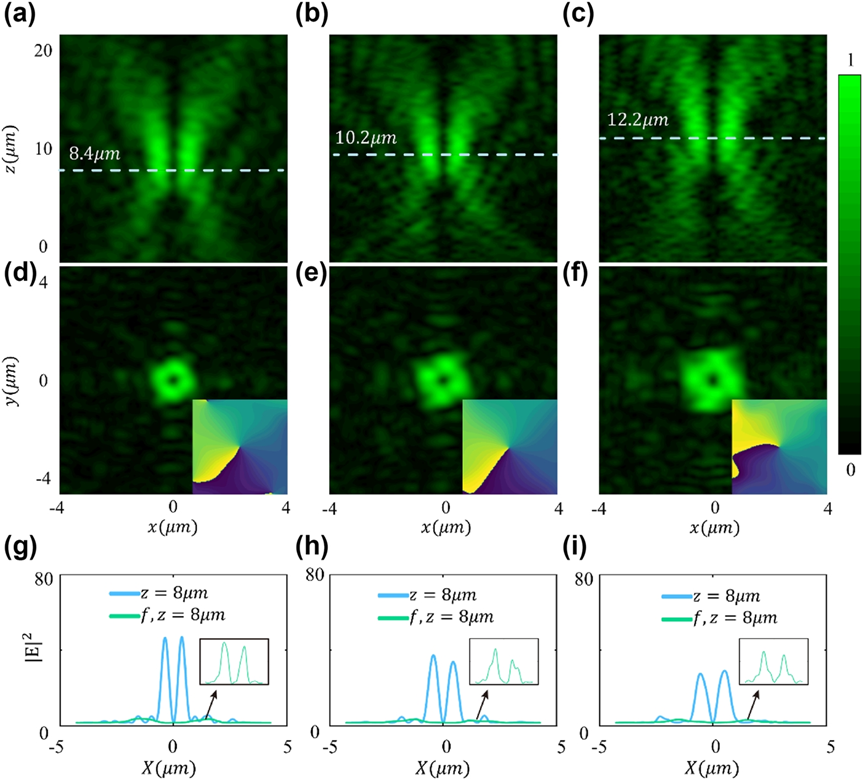

作者：田润，高丽
发表于：**_Nanophotonics_**

<!--more-->

## 1. 导读
携带轨道角动量的涡旋光有着独特的螺旋相位与环形强度分布，被誉为光学"隐形钥匙"，在量子通信、超分辨成像、粒子操控等领域具有颠覆性应用潜力。近年来，光学系统微型化和片上集成趋势对超薄高效光学元件产生了迫切的需求。为此，科学家们引入超表面进行复杂涡旋光的生成或调控。超表面是由亚波长结构组成的二维阵列，以极大设计灵活性塑造光波阵面，然而现有的设计普遍基于几何相位，非常依赖于圆偏振光的入射，且超表面功能单一，无法同时实现涡旋光的高效生成、动态偏转与精准聚焦。

针对这些问题，近日南京邮电大学高丽教授团队在Nanophotonics发表最新文章，在理论上提出了一种基于共振相位的多功能编码超表面设计方法，通过在石英基板上使用二氧化钛纳米圆柱体设计高效传输单元来构建编码单元，可以在目标波长高效的将透射光调制成涡旋波，其拓扑电荷根据编码序列而变化（见图1）。结合傅里叶卷积原理，可以将涡旋光束的生成、偏转和聚焦功能进行集成，得到具有特定偏转角度或者焦距的涡旋光束。这一成果具有显著的设计灵活性和效率，为光学通信、量子信息、纳米粒子操控等领域提供了全新的技术路径，有望推动高容量光通信和量子计算的进一步发展。

## 2. 研究背景
光学涡旋是指一种带有螺旋相位的光束，由波阵面围绕光轴的螺旋旋转形成。与传统的平面波和球面波相比，涡旋光束表现出独特的特征，如中心的奇异相位和圆环形的强度分布。其独特的轨道角动量（Orbital Angular Momentum, OAM）特性在光通信、粒子操控、量子信息及全息成像等领域展现出重要应用价值。传统生成光学涡旋的器件尺寸较大、功能单一，难以满足光学系统微型化和片上集成需求。

为解决这些实际问题，研究人员引入超表面的概念。超表面是由亚波长结构组成的二维阵列，以极大的设计灵活性塑造光波阵面。哈佛大学Capasso教授等人的开创性研究证明了使用超表面控制光的能力，通过操纵超表面上的相位分布产生异常衍射图案并产生涡流束。随后，基于Pancharatnam-Berry（PB）相位设计的超表面已被广泛用于涡流束产生和涡流束聚焦。然而现在对于生成涡旋光的设计大多停留在太赫兹、毫米波和微波等长波段，如何针对可见光波段高效率的生成和调控涡旋光是极为重要的科学问题。

## 3. 创新研究
针对上述挑战，南京邮电大学高丽课题组从透射式超表面出发，提出了一种实现可见光涡旋光束的高效生成与精准操控的新方法。通过在石英基板上使用二氧化钛纳米圆柱体设计了高效传输单元来构建编码单元，设计了一个具有8个编码单元的3位编码超表面，以保持一致的相位差。相较于传统PB相位设计，该方法摆脱了对圆偏振光的依赖，可直接利用线偏振光实现高效调控，简化了实验系统。使用上述3位编码单元，将8个单元以螺旋图案排列到编码超表面，可以将目标波长透射光调制成涡旋波，其拓扑电荷根据编码序列而变化。

同时，将编码超表面和梯度序列之间进行傅里叶卷积运算，根据角度相加计算规则，将两个编码序列组合在一起，可以产生一个能够偏转涡旋光束的超表面编码序列。对于一阶和二阶涡旋光，设计的超表面可以有效地将入射的线偏振光进行偏转或分成对称的两束涡旋光（如图2），偏转角度可以根据广义斯涅尔定律进行变化。

随后，通过进一步设计一个基于3位编码的紧凑型超表面透镜阵列，将涡旋相位与超透镜相位叠加，验证了涡旋光束的聚焦特性。在设计的焦距处，涡旋光的强度有很大的提升（如图3），同时保持涡旋光的轨道角动量特性，这一多功能设计显著提高了涡旋光束在远场传输中的能量利用率。

## 4. 应用与展望
该研究团队提出的编码超表面产生和调控涡旋光束的方法，结合傅里叶卷积原理，在高效生成涡旋光的同时实现对涡旋光的高效偏转和聚焦。这一多功能设计为轨道角动量（OAM）复用光通信、高安全量子通信及多粒子纳米操控等应用提供了全新解决方案。未来，团队计划结合动态可调材料（如液晶、相变材料）开发智能超表面，实现OAM态实时切换与动态调控，推动光学涡旋技术在量子计算、超分辨成像等领域的深度应用。

该研究成果以**_“Multifunctional metasurface coding for visible vortex beam generation, deflection and focusing”_**为题在线发表在**_Nanophotonics_**，并当选为当期封面论文。本文第一作者是硕士研究生田润，高丽教授为唯一通讯作者。团队隶属于南京邮电大学材料科学与工程学院、理学院和柔性电子全国重点实验室。