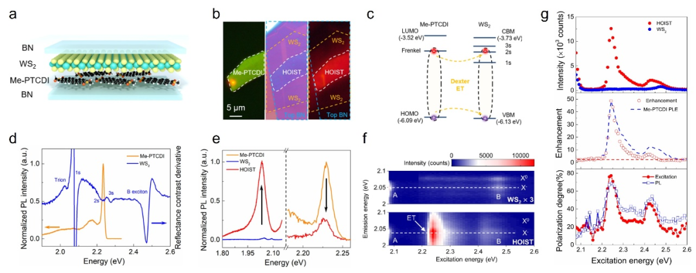
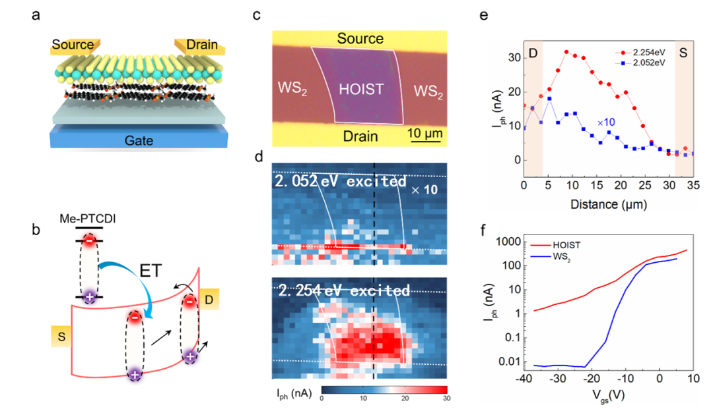

作者：赵慧娟，高丽  
发表于：**_Science Advances_**  
近期，南京邮电大学理学院高丽教授团队在二维有机/无机异质结能量转移机制与光电器件应用研究中取得重大突破。团队联合南京大学、西北工业大学等单位，在国际权威期刊《科学进展》(Science Advances)上发表题为“Efficient energy transfer in a hybrid organic-inorganic van der Waals heterostructure”的研究论文。该工作通过高效共振能量转移，使二维半导体荧光增强逾百倍，光电探测器响应度提升近三个数量级且保持超快响应，为突破原子级吸收极限与高速光电子器件设计开辟新途径，以下是详细报道。
<!--more-->

尽管二维半导体材料如过渡金属硫化物具有优异的光-物质相互作用和可设计的电子结构，但原子级厚度导致本征光吸收极低，严重限制其在光电器件中的应用。通过敏化层增强吸收的方法一般会严重限制器件响应速度。能量转移（ET）是以相干电子-空穴对形式进行的非辐射能量传递，然而，由于其常与超快电荷转移过程竞争，且受限于材料间能态匹配和波函数重叠等困难，在二维异质结构中实现纯ET一直面临极大挑战。    

针对上述难题，研究团队设计并构建了一种新型二维有机—无机杂化异质结构，以单层Me-PTCDI有机分子晶体作为供体，WS₂作为受体。该结构的创新之处在于供体的Frenkel激子发射与WS₂的2s暗激子态实现精准共振，通过Dexter电子交换机制实现了高效的激子转移。实验结果表明，在该异质结构中WS₂的光致发光强度最高增强至124倍，为目前已报道同类体系中的最高值。理论计算揭示，得益于层间距的减小和受体2s激子态的空间离域特性，其ET速率比传统无机异质结构高出一个数量级。进一步，将这一机制成功应用于光晶体管器件中，在保持原有纳秒级响应速度的同时，光响应度提升近1000倍，解决了传统电荷转移器件中常见的响应度与速度之间的矛盾。该研究不仅深化了对二维材料界面能量转移动力学的理解，也为发展新一代超快、高灵敏度光电探测器提供了可靠的材料平台与技术路径。    

南京邮电大学高丽教授、南京大学王欣然教授和西北工业大学甘雪涛教授为共同通讯作者，南京大学/西北工业大学陈小青博士和高丽团队青年教师赵慧娟博士与为论文共同第一作者。

全文链接：Xiaoqing Chen et al. ,Efficient energy transfer in a hybrid organic-inorganic van der Waals heterostructure . Sci. Adv. 11 , eadw3969 (2025) . DOI:10.1126/sciadv .adw3969
[https://www.science.org/doi/10.1126/sciadv.adw3969](https://www.science.org/doi/10.1126/sciadv.adw3969)   
上述研究获得国家自然科学基金柔性电子基础科学中心、区域联合重点项目、国家重点研发计划、江苏省重大专项和基础研究计划等资助。